# Модель данных: черновик

Это предварительный список сущностей. Поля будут уточняться перед миграциями.

Модель обновлена после анализа Shopify, WooCommerce HPOS, Medusa, Saleor и Sylius. Главная идея: товар и склад не смешиваем. `products` описывает товар, `product_variants` описывает продаваемую версию товара, `inventory_items` и `inventory_levels` отвечают за склад.

## Основные сущности

Русские объяснения терминов лежат в [глоссарии](06-glossary.md). В коде и БД оставляем английские имена, потому что так проще работать с Symfony, Doctrine, API и документацией.

### tenants

- id
- name
- status
- billing_email
- created_at
- updated_at

### stores

- id
- tenant_id
- name
- slug
- domain
- status
- default_currency
- timezone
- created_at
- updated_at

### storefront_settings

- id
- store_id
- logo_file_id
- primary_color
- secondary_color
- contact_email
- contact_phone
- seo_title
- seo_description
- published_at
- updated_at

### storefront_blocks

- id
- store_id
- type
- title
- payload
- sort_order
- is_active
- created_at
- updated_at

### sales_channels

- id
- store_id
- code
- name
- type
- currency
- is_active
- created_at
- updated_at

### users

- id
- tenant_id
- email
- phone
- password_hash
- status
- created_at
- updated_at

### roles

- id
- tenant_id
- code
- name
- description

### user_roles

- id
- user_id
- role_id
- store_id

### customers

- id
- store_id
- email
- phone
- name
- status
- created_at
- updated_at

### customer_addresses

- id
- customer_id
- type
- country
- city
- street
- postal_code
- raw_address
- created_at
- updated_at

### categories

- id
- store_id
- parent_id
- name
- slug
- description
- sort_order
- is_active

### products

- id
- store_id
- name
- slug
- description
- status
- is_active
- created_at
- updated_at

### product_categories

- id
- product_id
- category_id
- sort_order

### product_variants

- id
- product_id
- sku
- barcode
- name
- slug
- price
- compare_at_price
- currency
- weight
- requires_shipping
- manage_inventory
- allow_backorder
- position
- status
- created_at
- updated_at

### product_options

- id
- product_id
- name
- code
- position

### product_option_values

- id
- option_id
- value
- code
- position

### variant_option_values

- id
- variant_id
- option_value_id

### product_images

- id
- product_id
- variant_id
- file_id
- sort_order
- alt_text

### stock_locations

- id
- store_id
- name
- code
- type
- address
- is_active
- created_at
- updated_at

### inventory_items

- id
- store_id
- variant_id
- sku
- requires_shipping
- tracked
- created_at
- updated_at

### inventory_levels

- id
- inventory_item_id
- stock_location_id
- stocked_quantity
- reserved_quantity
- incoming_quantity
- updated_at

### inventory_reservations

- id
- inventory_item_id
- stock_location_id
- order_id
- cart_id
- quantity
- status
- expires_at
- created_at
- updated_at

### carts

- id
- store_id
- sales_channel_id
- customer_id
- token
- status
- currency
- created_at
- updated_at

### cart_items

- id
- cart_id
- variant_id
- product_name
- variant_name
- sku
- quantity
- unit_price
- total_price

### orders

- id
- store_id
- sales_channel_id
- customer_id
- number
- status
- total_amount
- currency
- customer_name
- customer_email
- customer_phone
- created_at
- updated_at

### order_items

- id
- order_id
- variant_id
- product_name
- variant_name
- sku
- quantity
- unit_price
- total_price

### order_addresses

- id
- order_id
- type
- country
- city
- street
- postal_code
- raw_address
- created_at
- updated_at

### order_status_history

- id
- order_id
- user_id
- old_status
- new_status
- comment
- created_at

### payments

- id
- order_id
- provider
- status
- amount
- external_id
- created_at
- updated_at

### deliveries

- id
- order_id
- provider
- status
- address
- tracking_number
- created_at
- updated_at

### files

- id
- store_id
- storage
- path
- mime_type
- size
- created_at

### audit_logs

- id
- tenant_id
- store_id
- user_id
- action
- entity_type
- entity_id
- payload
- created_at

### backups

- id
- tenant_id
- store_id
- status
- storage_path
- started_at
- finished_at
- error_message

### resource_usage_daily

- id
- tenant_id
- store_id
- date
- resource_type
- quantity
- unit
- source
- created_at

### store_usage_limits

- id
- store_id
- plan_code
- resource_type
- soft_limit
- hard_limit
- unit
- reset_period
- created_at
- updated_at

## ER-диаграмма

```mermaid
erDiagram
    tenants ||--o{ stores : owns
    tenants ||--o{ users : has
    tenants ||--o{ roles : defines
    users ||--o{ user_roles : has
    roles ||--o{ user_roles : assigned
    stores ||--o{ sales_channels : sells_through
    stores ||--o{ customers : has
    customers ||--o{ customer_addresses : has
    stores ||--o{ categories : has
    stores ||--o{ products : has
    products ||--o{ product_categories : categorized
    categories ||--o{ product_categories : includes
    products ||--o{ product_variants : has
    products ||--o{ product_options : defines
    product_options ||--o{ product_option_values : has
    product_variants ||--o{ variant_option_values : selected
    product_option_values ||--o{ variant_option_values : used_by
    products ||--o{ product_images : has
    product_variants ||--o{ product_images : may_have
    stores ||--o{ stock_locations : has
    stores ||--o{ inventory_items : tracks
    product_variants ||--o{ inventory_items : stocked_as
    inventory_items ||--o{ inventory_levels : has
    stock_locations ||--o{ inventory_levels : stores
    inventory_items ||--o{ inventory_reservations : reserves
    stock_locations ||--o{ inventory_reservations : reserves_at
    stores ||--o{ carts : has
    sales_channels ||--o{ carts : receives
    carts ||--o{ cart_items : contains
    product_variants ||--o{ cart_items : added_as
    stores ||--o{ orders : receives
    sales_channels ||--o{ orders : creates
    customers ||--o{ orders : places
    orders ||--o{ order_items : contains
    product_variants ||--o{ order_items : sold_as
    orders ||--o{ order_addresses : has
    orders ||--o{ order_status_history : changes
    orders ||--o{ payments : paid_by
    orders ||--o{ deliveries : shipped_by
    stores ||--o| storefront_settings : configures
    stores ||--o{ storefront_blocks : renders
    files ||--o{ storefront_settings : logo
    stores ||--o{ files : stores
    stores ||--o{ audit_logs : records
    stores ||--o{ backups : creates
    stores ||--o{ resource_usage_daily : consumes
    stores ||--o{ store_usage_limits : limits
```

